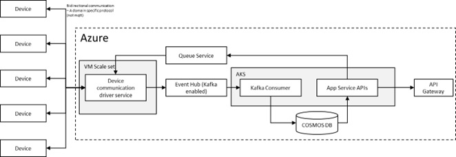
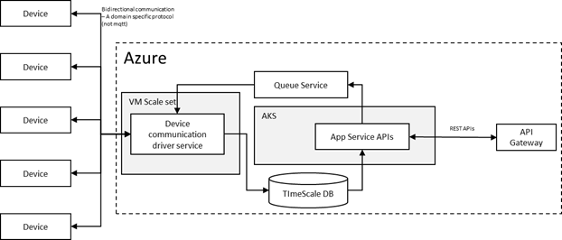

Recently I worked on the performance and cost optimization of one of our core SaaS product offerings. The concern was that the Azure bill for one of the subsystems was much higher than expected, and that level of the Azure bill was not sustainable for the business.
After deep dive with the operations team, I understood that the operations team had already taken all possible steps to optimize the cost. So, my next step was to consider architecture and design and fresh implementation. In principle, all stakeholders supported the decision there were also concerns about performance and scalability.
Existing Implementation:
        Below is a simplified diagram (perhaps overly simplified!) of the existing architecture. Please note that I have omitted some components of the subsystem for the sake of simplicity and confidentiality.

  
  The key architectural aspects of the sub-system are as follows:
1.	The device-to-cloud communication does not use MQTT; rather, it employs a domain-specific protocol, which rules out the use of Azure IoT Hub.
2.	Although not relevant to this blog, I would like to mention that due to domain-specific reasons and constraints, the data reads were initiated from the cloud, rather than pushed automatically or on a periodic basis by the device. This is a separate topic that I will not discuss further here.
3.	It's important to note that the devices expose public IPv6 addresses, not IPv4. Unfortunately, Azure Kubernetes does not support IPv6, so we had to run the device driver software on Azure VMS, where we could set up IPv6 networking.
4.	A third-party communication driver Java library was used, with a Java wrapper on top of the Java third-party libraries. I proposed technical POC, Objectives of POC are as below.

I got started with a technical POC with the following objectives:
1.	Reduce the monthly Azure bill by at least 30%.
2.	Improve performance by reducing the time to read data from all devices from 45 minutes (current) to 5 minutes.
3.	Ensure horizontal scaling up to millions of devices without affecting performance (i.e., time to read data from all devices must remain at 5 minutes).

To meet the NFRs, we needed to re-architect the system. Given the system's scale, selecting an efficient technology stack was crucial. Therefore, we evaluated the C-stack version of the third-party communication driver and chose to use Golang as a wrapper, which provides Goroutines concurrency capabilities to spin off multiple instances for improved performance. In addition, we selected Timescale (PostgreSQL) as the telemetry database.
The new architecture is as follows:

    
    
    Note: For simplicity and confidentiality reasons, not all components of the subsystem have been included in the diagram.
In the new architecture, another major change is the removal of the EventHub (Kafka) message broker. We quickly implemented the new architecture to evaluate and subjected the new code to performance and scalability tests. 
In the new architecture, a major change was the removal of the EventHub (Kafka) message broker. We quickly implemented the new architecture for evaluation and subjected the new code to performance and scalability tests. 
The results were phenomenal - we were able to read data from all devices within 4 minutes and could scale horizontally. Furthermore, the Azure bill will be 70% less than before. 
So, what was the secret behind such stellar performance?
Was it the removal of Event Hub? No, the Azure Event Hub cost was relatively low. The real magic was the use of Golang routines! 
We could easily spin off 4000 goroutines per process with minimal code (max 5 lines for goroutines code to manage at scale). We were thrilled to discover how easy it is to run concurrency with goroutines. We tested it for 200K devices (simulators), and we observed that CPU usage was less than 20% and RAM usage was less than 1GB. Goroutines are so lightweight!
Another magical aspect was the use of Timescale DB (Postgres). We were able to concurrently reach 10K writes and 100 reads per second, keeping CPU usage less than 70% and RAM usage around 6GB.
All of this is impressive, but we had to shelve the existing code and move to a completely new technology stack and codebase. This decision required an upfront investment justified by benefits for the sustainable business case.
In summary:
The architecture team should have clear priorities for the NFRs. Architecture goals should be precisely aligned with sustainable business cases in the long run. An architecture that cannot support the business case in terms of cost, performance, and complexity will not be sustainable! There is always a trade-off between the NFRs while architecting.
