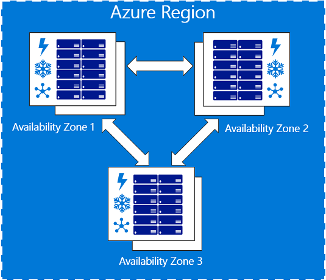

# Azure Fundamentals
As a beginner, what you must start learning in azure?

    I. Azure Fundamentals
        a. What is Azure?
        b. IaaS, PaaS, SaaS, (and many more example Cluster as a service, Managed App as Service)
        c. Azure Datacenter and Regions
    II. Availability Options
        a. Update Domain
        b. Fault Domain
        c. Availability Zones
        d. Azure SLA
    III. Azure resource groups
    IV. Azure Resource Manager 
        a. Azure portal
        b. Microsoft Azure PowerShell
        c. Azure Command-Line Interface (Azure CLI)
        d. REST API
        e. Client SDKs
    V. Azure Core Services
    VI. Azure compute
        a. Virtual Machines
        b. App Services
        c. Azure Container Instances
        d. Azure Kubernetes Service
        e. ...
    VII. Azure network services
        a. Azure Virtual network and subnets
        b. Azure Load balancer
        c. VPN and VPN Gateway
        d. Azure Application Gateway
        e. CDN
        f.  ...
    VIII. Azure Storage
        a. Disk Storage
        b. Blob Storage (Containers and DataLake Gen2)
        c. File Storage
        d. Queues
        e. Tables
        f. ....
    IX. Azure Databases
        a. Azure SQL
        b. Azure COSMOS DB
    X. Azure Solutions
    XI. Azure Market Place

=================================

Further:

    * Azure Database for MySQL 

    * Azure Redis cache

    * Azure Cognitive Search

    * Azure Notification Hubs

    * Azure Service Bus

    * Azure Functions

    * Azure Monitor

## What is Azure? 

The public cloud (in this case Azure) is computing services (servers, storage etc) offered by third-party providers (in this case Microsoft) over the public Internet.

### Private Cloud (internal or corporate cloud)
The private cloud is defined as computing services offered either over the Internet or a private internal network and only to select users instead of the general public.

Private clouds require the same staffing, management, and maintenance expenses as traditional datacenter ownership.

### Hybrid Cloud

Public Cloud + Private Cloud

### Characteristics of Cloud Computing
1. Elasticity
2. Resiliency and availability
3.  Resource Sharing between multiple tenants
4. On-Demand
5. Self Service
6. Pay only for what is used 
7. Security
8. Available over internet

### Datacenters and Regions
Azure datacenters are organized as regions. 
A Region is a geographical area containing at least one, usually multiple datacenters that are in close proximity and networked together with a low-latency network.
List of Azure regions can be see [here](https://azure.microsoft.com/en-us/global-infrastructure/geographies/)

Read more about Azure regions [here](https://docs.microsoft.com/en-us/azure/virtual-machines/regions)

Read about Regional Pairs [here](https://docs.microsoft.com/en-us/azure/best-practices-availability-paired-regions#what-are-paired-regions?azure-portal=true)

Read about Azure special Regions [here](https://docs.microsoft.com/en-us/azure/virtual-machines/regions#special-azure-regions)

## Availability Options

### Availability sets
1. Update domains (UD) 
2. Fault domains (FD)

### Availability Zones

### Azure SLA
You can see the Azure SLA [here](https://azure.microsoft.com/en-us/support/legal/sla/summary/)

### Azure Resource groups

